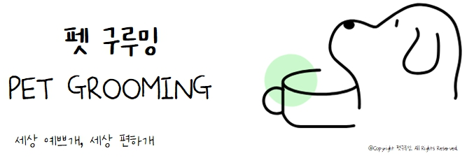

# 프로젝트 소개

  

---
 

> 코로나 이후 현대 사회는 반려동물 보유 가구 수의 비율이 폭발적으로 증가했고, 반려동물 미용 업체의 수도 전국적으로 매년 증가하는 추세입니다.
> 펫구루밍(petgrooming)은 점점 높아지는 반려동물 위생 및 미용 관심도를 기반으로 시작한 프로젝트입니다.
>
> 해당 서비스에서 사용자는 필요한 정보를 제공하고 원하는 상품을 예약할 수 있으며, 관리자는 쉽게 직원, 상품, 예약을 관리할 수 있으며 매출 통계를 통해 매장을 효율적으로 관리할 수 있는 예약 웹 서비스입니다.

### Features
>* 사용자는 다양한 상품을 한 눈에 보고 비교하여 쉽게 예약 가능
>* 관리자는 상품 및 예약, 매출을 손 쉽게 관리 가능
>* 일관적이며 직관적인 UI를 통해 사용자와 관리자에게 쉡고 빠른 서비스를 제공

 ### Develope
>* 👉[Front-end](https://github.com/Kiddle-Way/PetGrooming/tree/main/PetGrooming-Frontend) 
>* 👉[Back-end](https://github.com/Kiddle-Way/PetGrooming/tree/main/PetGrooming-Backend)
